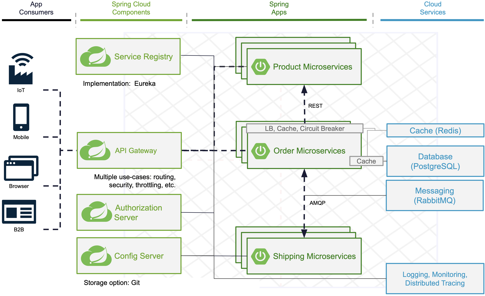

# Demo for a typical Modern App Architecture with Spring Cloud



[Presentation slides](docs/slides.pdf)

## Deployment

### Docker Compose
```
./mvnw spring-boot:build-image
docker compose up
```

```
GATEWAY_URL="http://0.0.0.0:$(docker compose port gateway 8080 | awk -F ':' '{print $2}')"
ACCESS_TOKEN=$(curl --location 'http://localhost:9000/oauth2/token' \
--header 'Content-Type: application/x-www-form-urlencoded' \
--header "Authorization: Basic $(echo -n "default-client-id:default-client-secret" | base64)" \
--data-urlencode 'grant_type=client_credentials' \
--data-urlencode 'scope=openid profile' | jq -r .access_token)
```

## API usage
- Fetch products:
  ```
  curl $GATEWAY_URL/services/product-service/api/v1/products --header "Authorization: Bearer $ACCESS_TOKEN"
  ```
- Fetch orders:
  ```
  curl $GATEWAY_URL/services/order-service/api/v1/orders --header "Authorization: Bearer $ACCESS_TOKEN"
  ```
- Create order (After 10 seconds the status of the order should be DELIVERED)
  ```
  curl -XPOST "$GATEWAY_URL/services/order-service/api/v1/orders" --header "Authorization: Bearer $ACCESS_TOKEN" --header "Content-Type: application/json" --data '{"productId":1,"shippingAddress":"Stuttgart"}'
  ```
- Update externalized application configuration
  Fork the repository and adjust the `spring.cloud.config.server.git.uri` configuration in [config-server/src/main/resources/application.yaml](config-server/src/main/resources/application.yaml).
  Change the `product-service.product-names` configuration property in [externalized-configuration/product-service.yaml](externalized-configuration/product-service.yaml) and run the following command to refresh the bean with the new configuration.
  ```
  curl -XPOST $GATEWAY_URL/services/product-service/actuator/refresh --header "Authorization: Bearer $ACCESS_TOKEN"
  ```