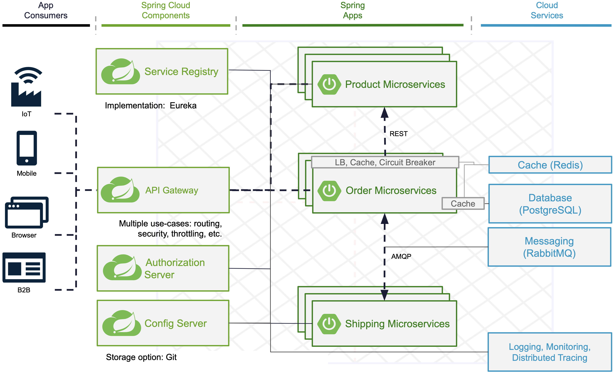

# Demo for a typical Modern App Architecture with Spring Cloud



[Presentation slides](docs/slides.pdf)

## Prerequisites
- A Tanzu Platform 10.2 environment
- [Spring Application Advisor installed](https://techdocs.broadcom.com/us/en/vmware-tanzu/spring/spring-application-advisor/1-4/spring-app-advisor/run-app-advisor-cli.html)

## Demo

Checkout and follow previous steps: [part 1](https://github.com/timosalm/modern-app-arch-spring-cloud/tree/1_tanzu-platform-sb-2-7), [part2](https://github.com/timosalm/modern-app-arch-spring-cloud/tree/2_tanzu-platform-services-resiliency)

### Add Shipping Service
```
(cd shipping-service && ./mvnw clean package)
(cd shipping-service && cf push)
cf bind-service shipping-service rabbit
cf bind-service shipping-service configserver
cf bind-service shipping-service service-registry
cf restage shipping-service
```

### Add GenAi
```
cf create-service genai gemma2:2b aimodel
cf bind-service order-service aimodel

(cd order-service && ./mvnw clean package)
(cd order-service && cf push)
```


